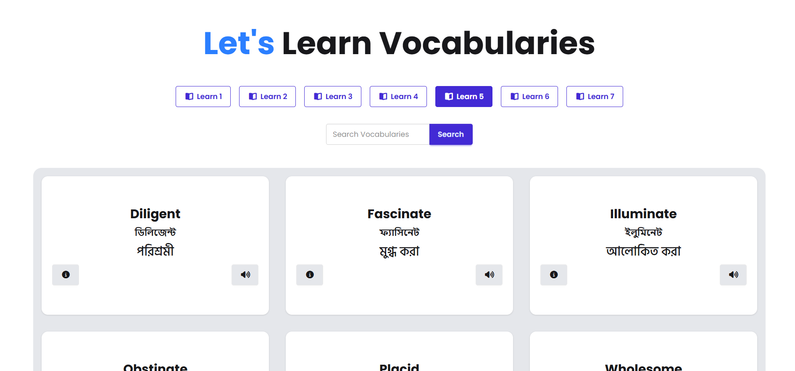
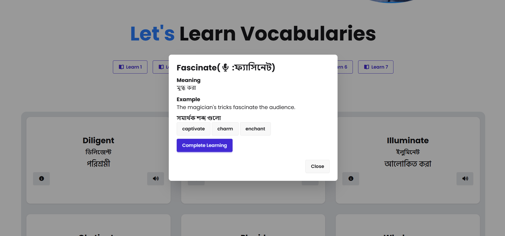

# English Janala | Easy to Learn

English Janala is a web app designed to make learning English easier for Bengali speakers.  
It provides interactive lessons with vocabulary, pronunciation, meanings, and example sentences.

---

## 🚀 Features
- Responsive UI built with **Tailwind CSS** and **DaisyUI**
- Vocabulary levels with interactive buttons
- Word pronunciation using **SpeechSynthesis API**
- Detailed word information (meaning, example, synonyms)
- Search functionality to find words quickly
- Modal-based word details display

---

## 🛠️ Technologies Used
- HTML5
- CSS3 / Tailwind CSS / DaisyUI
- JavaScript (ES6+)
- Font Awesome Icons
- Google Fonts
- Programming Hero Open API

---

## 📸 Screenshots
 ,  
 ,

---

## 📂 Project Setup
1. Clone the repository:
   ```bash
   git clone https://github.com/taniashahida-dev/English-janala.git